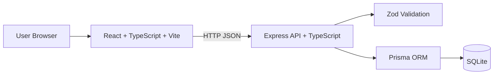

# FocusBoard 最終まとめ

## 1. アプリ概要
- **アプリ名**: FocusBoard
- **目的**: 締切付きタスクのリスクを可視化し、先送りを減らす
- **対象ユーザー**: 個人ワーカー、学生、少人数プロジェクト担当者
- **提供価値**:
  - 締切リスクの可視化（本日期限/期限切れ）
  - 探索コスト削減（検索・ソート）
  - 処理コスト削減（一括完了/アーカイブ）
  - 回復性向上（Undo、再試行、エラー分類）

## 2. 技術構成図



## 3. コード構成

```text
.
├─ apps
│  ├─ server
│  │  ├─ prisma
│  │  │  ├─ schema.prisma
│  │  │  └─ migrations/
│  │  ├─ src
│  │  │  ├─ app.ts
│  │  │  ├─ index.ts
│  │  │  ├─ lib
│  │  │  │  ├─ prisma.ts
│  │  │  │  └─ validation.ts
│  │  │  └─ routes
│  │  │     ├─ health.ts
│  │  │     └─ tasks.ts
│  │  └─ tests/tasks.api.test.ts
│  └─ web
│     ├─ src
│     │  ├─ api/tasks.ts
│     │  ├─ components/
│     │  ├─ types/task.ts
│     │  ├─ App.tsx
│     │  └─ styles.css
│     └─ vite.config.ts
├─ docs
│  ├─ iterations
│  │  ├─ loop1.md
│  │  ├─ loop2.md
│  │  └─ loop3.md
│  └─ final-summary.md
├─ package.json
└─ tsconfig.base.json
```

## 4. 3ループの成果要約

## Loop1（MVP）
- CRUD、期限、優先度、フィルタ、KPIを実装
- FE/BE/DB/APIを最小縦断で完成

## Loop2（運用効率）
- 検索、ソート、一括完了、一括アーカイブを追加
- `archivedAt` と `PATCH /tasks/bulk` を導入

## Loop3（信頼性・UX）
- APIエラー分類をUIで扱う実装へ
- 削除Undo、楽観更新ロールバック、ショートカット、JSONエクスポートを追加

## 5. 主要トレードオフ
- 運用効率と回復性は向上したが、状態管理は複雑化
- 小規模向けのSQLite設計は導入容易だが、大規模運用には追加設計が必要

## 6. 将来的な拡張構想
1. 認証・ユーザー分離（OAuth/Email login）
2. ページング/カーソルで大量データ対応
3. 通知（期限前リマインド）
4. インポート機能（現在のJSONエクスポートの逆方向）
5. 監査ログ/操作履歴
6. チーム共有（担当者、コメント、権限）
